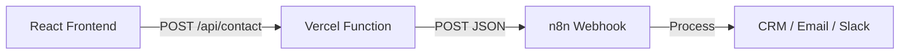

# N8N Webhook Integration Plan

This document outlines the strategy for moving from a `mailto:` based form submission to a professional **n8n.io** workflow integration using a Vercel-hosted API bridge to handle CORS and privacy.

## 🎯 Objectives
1.  **Replace `mailto:` logic** with a robust API call.
2.  **Bypass CORS** using a Vercel Serverless Function.
3.  **Enhance Lead Data**: Collect separate First/Last names and GDPR consent.
4.  **Connect to n8n**: Send structured JSON to a specified webhook.

## 🛠️ Technical Architecture

### 1. Data Schema Update
The submission payload will be updated to:
- `firstName`: string (required)
- `lastName`: string (required)
- `email`: string (required)
- `company`: string (optional)
- `message`: string (optional)
- `gdprConsent`: boolean (required)
- `diagnosticData`: object (optional)
- `source`: string (e.g., "audit_form" or "business_diagnostic")

### 2. Infrastructure (Vercel API)
Since the project is hosted/built for Vercel, we will add a serverless function at `/api/contact.ts`.
- **Purpose**: Acts as a secure proxy.
- **Security**: Keeps the `N8N_WEBHOOK_URL` hidden from the browser.
- **CORS**: Handles the request internally on the same domain.

### 3. Frontend Modifications

#### `src/lib/submitForm.ts`
- Update the `AuditRequest` interface. [DONE]
- Ensure `MODE="api"` points to the local `/api/contact` endpoint. [DONE]

#### `src/components/AuditForm.tsx`
- **Step 1 Refresh**: Split "Name" into two inputs: "First Name" and "Last Name". [DONE]
- **Step 3/Final Step**: Add a required GDPR compliance checkbox with a link to the privacy policy. [DONE]
- **Validation**: Ensure the "Finalize" button is disabled unless GDPR is checked. [DONE]

#### `src/components/BusinessDiagnostic.tsx` (Enriched)
- Ensure the "Get My Full Audit RoadMap" button passes results to the form. [DONE]

## 🚀 Step-by-Step Implementation

### Phase 1: Environment Setup
- [x] Add `N8N_WEBHOOK_URL` to `.env` (local) and Vercel Dashboard.
- [x] Set `VITE_FORM_MODE=api`.

### Phase 2: The API Bridge
- [x] Create `api/contact.ts` (Vercel Serverless Function).
- [x] Implement POST handler that forwards data to `process.env.N8N_WEBHOOK_URL`.

### Phase 3: Frontend Refactor
- [x] Update `src/lib/submitForm.ts` types.
- [x] Refactor `AuditForm.tsx` UI:
    - Add `firstName`, `lastName` state.
    - Add `gdprConsent` checkbox.
    - Update the `handleSubmit` payload.

### Phase 4: Data Enrichment & Verification
- [x] Implement shared state in `App.tsx` for diagnostic data.
- [x] Update `BusinessDiagnostic` to emit results.
- [x] Update `AuditForm` to ingest and forward diagnostic data.
- [x] Verify n8n receives the full enriched payload.

## 📝 Suggested Improvements
- **Confirmation UI**: Update the "Success" state to mention that the roadmap is being generated by the automation engine. [DONE]
