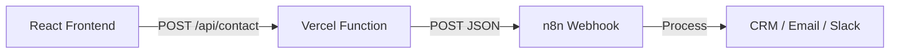

# N8N Webhook Integration Plan

This document outlines the strategy for moving from a `mailto:` based form submission to a professional **n8n.io** workflow integration using a Vercel-hosted API bridge to handle CORS and privacy.

## 🎯 Objectives
1.  **Replace `mailto:` logic** with a robust API call.
2.  **Bypass CORS** using a Vercel Serverless Function.
3.  **Enhance Lead Data**: Collect separate First/Last names and GDPR consent.
4.  **Connect to n8n**: Send structured JSON to a specified webhook.

## 🛠️ Technical Architecture

### 1. Data Schema Update
The submission payload will be updated to:
- `firstName`: string (required)
- `lastName`: string (required)
- `email`: string (required)
- `company`: string (optional)
- `message`: string (optional)
- `gdprConsent`: boolean (required)
- `source`: string (e.g., "audit_form" or "diagnostic")

### 2. Infrastructure (Vercel API)
Since the project is hosted/built for Vercel, we will add a serverless function at `/api/contact.ts`.
- **Purpose**: Acts as a secure proxy.
- **Security**: Keeps the `N8N_WEBHOOK_URL` hidden from the browser.
- **CORS**: Handles the request internally on the same domain.

### 3. Frontend Modifications

#### `src/lib/submitForm.ts`
- Update the `AuditRequest` interface.
- Ensure `MODE="api"` points to the local `/api/contact` endpoint.

#### `src/components/AuditForm.tsx`
- **Step 1 Refresh**: Split "Name" into two inputs: "First Name" and "Last Name".
- **Step 3/Final Step**: Add a required GDPR compliance checkbox with a link to the privacy policy.
- **Validation**: Ensure the "Finalize" button is disabled unless GDPR is checked.

#### `src/components/BusinessDiagnostic.tsx` (Optional but Recommended)
- Ensure the "Generate Full Report" button passes the diagnostic results (score, sector, scale) to the form so the lead is fully enriched when it hits n8n.

## 🚀 Step-by-Step Implementation

### Phase 1: Environment Setup
- [ ] Add `N8N_WEBHOOK_URL` to `.env` (local) and Vercel Dashboard.
- [ ] Set `VITE_FORM_MODE=api`.

### Phase 2: The API Bridge
- [ ] Create `api/contact.ts` (Vercel Serverless Function).
- [ ] Implement POST handler that forwards data to `process.env.N8N_WEBHOOK_URL`.

### Phase 3: Frontend Refactor
- [ ] Update `src/lib/submitForm.ts` types.
- [ ] Refactor `AuditForm.tsx` UI:
    - Add `firstName`, `lastName` state.
    - Add `gdprConsent` checkbox.
    - Update the `handleSubmit` payload.

### Phase 4: Testing & Verification
- [ ] Test local submission with a mock webhook (e.g., webhook.site).
- [ ] Verify that n8n receives the correctly formatted JSON.

## 📝 Suggested Improvements
- **Enrichment**: We should pass the "Friction Score" and "Sector" from the `BusinessDiagnostic` component through to the `AuditForm` so n8n knows exactly what the user was looking at.
- **Confirmation UI**: Update the "Success" state to mention that the roadmap is being generated by the automation engine.
